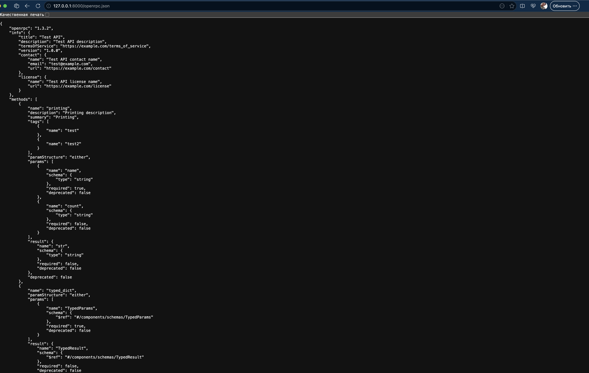

# Django jsonrpc implementation

## Advantages

- Complete support jsonrpc 2.0 (Request, Notificatin, Batch)
- Auto generation openrpc.json 1.3.2 version
- Auto generation OpenRPC documentation (like swagger)
- Async support

## Create methods

We provide several methods creating methods. 

- Using `method_` prefix
- Using `jsonrpc_method` decorator
- Rename existing func to new name

``` python

from django_jsonrpc import BaseController
from django_jsonrpc.controller.decor import jsonrpc_method

class EchoController(BaseController):
    
    def method_echo_hello(self, name: str) -> str:
        return f"hello {name}"

    @jsonrpc_method
    def echo_goodbye(self, name: str) -> str:
        return f"goodbye {name}"

    @jsonrpc_method("echo_see_you")
    def wrong_name(self, name) -> str:
        retorn "See you fron echo_see_you method"

```

## Adding several controllers to one controller

``` python
from django_jsonrpc import RouteController

class PrintController(BaseController):

    async def method_print_hello(self, name) -> None:
        print(f"hello {name}")

    @jsonrpc_method
    async def print_goodbye(self, name) -> None:
        print(f"goodbye {name}")
 

route = RouteController(
    'jsonrpc',
    controllers=[
        PrintController,
        EchoController,
    ]
    
)
```

## Generation openrpc.json and OpenRpc documentation

``` python
from django_jsonrpc.controller.openrpc.collectors import OpenRpcCollector

collector = OpenRpcCollector(
    PrintController,
    EchoController,
    title='My mini API'
)


urlpatterns = [
    path('echorpc', EchoController,as_view)
    path('jsonrpc', route.as_view()),
    path('openrpc.json', OpenRpcJsonView.as_view(collector=collector)),
    path('docs', OpenRpcDocView.as_view()),
]

```

### Openrpc.json example



## Openrpc doc example


