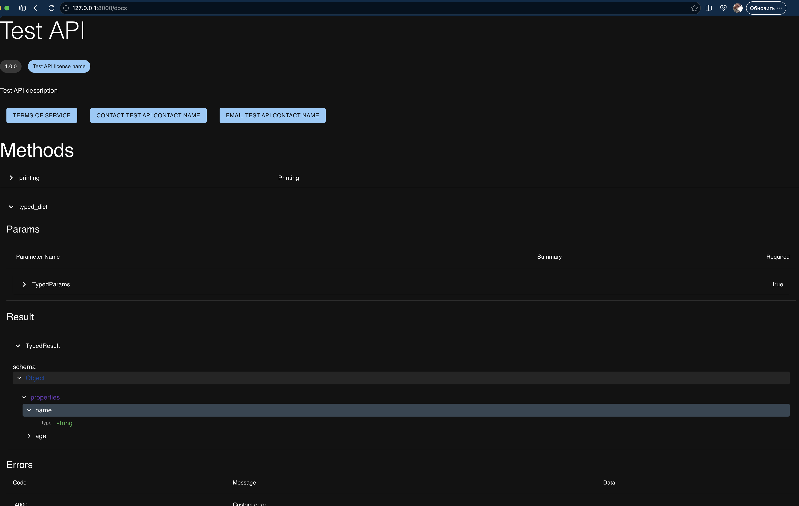

# OpenRpc

Django-jsonrpc have a complete implementation of OpenRpc specification using 
`Pydantic`.

> [!WARNING]
> But only a small part its connected with user API, see next table
 
 | Part of documentation specification    | Implemenation Status | 
 | ---------------------------------------| -------------------- |
 | Info                                   | Full                 |
 | Servers                                | None                 |
 | Methods                                | Partially            |
 | Components                             | Only for library use |
 | externalDocs                           | None


## How to enable

The OpenRpc documentation work only if have openrpc json view, lets connect it first.

``` python
from django_jsonrpc.controller.openrpc._openrpc import OpenRpcJsonView, OpenRpcDocView
from django_jsonrpc.controller.openrpc.collectors import OpenRpcCollector

collector = OpenRpcCollector(EchoController)

urlpatterns = [
    ...
    path('openrpc.json', OpenRpcJsonView.as_view(collector=collector)),
]
```

The `OpenRpcCollector` create a json structure of your API, and provide it to your endpoint using the `OpenRpcJsonView`.
Next the `

Next step, connecting the `OpenRpcDocView`, its using a `/openrpc.json` to 
render your API visualization. Just add it below. 

``` python
urlpatterns = [
    ...
    path('openrpc.json', OpenRpcJsonView.as_view(collector=collector)),
    path('docs', OpenRpcDocView.as_view()),
]
```

### Pre-generation openrpc file

For the purpose of improving startup performance, you have opportunity
pre-generating your schema, to decrease the start time your application.

Just use command with your arguments

```
python manage.py generate_openrpc --collector myproject.openrpc.collector --output my_openrpc.json
```

Next, set up file path setting

```
DJANGO_JSONRPC_DOCS: {
    "SCHEMA_PATH": "my_openrpc.json"
}
```


### Custom path to openrpc file

If you have another endpoint to your `openrpc.json` file, you need change 
`OpenRpcDocView` settings to your path 

```
DJANGO_JSONRPC_DOCS: {
    "SCHEMA_PATH": "my_path/openrpc.json"
}
```

## Info

``` 
While creating a OpenRpcCollector you have an opportunity to create `Info` about
your project, see next.

``` python
from django_jsonrpc.controller.openrpc.collectors import OpenRpcCollector
from django_jsonrpc.openrpc.document.info import OpenRpcContact, OpenRpcLicense

class EchoController(BaseController):

    def method_echo1(self, *name: tuple[str]) -> str:
        return f"Echo first {name}"

collector = OpenRpcCollector(
    EchoController,
    title="Echo Api",
    version="1.0.0",
    description="API echo methods",
    terms_of_service="https://example.com/terms_of_service",
    contact=OpenRpcContact(name="ExampleName", email="expert@example.com", url="https://example.com/contact"),
    license=OpenRpcLicense(name="Example License", url="https://example.com/license"),
)
```

After open the docs page, we see next result. If you have a long download,
maybe you have problem with access to cdn, try to disable VPN or use
self-hosted CDN files.


